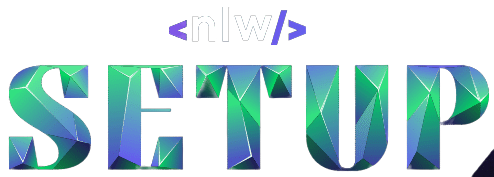
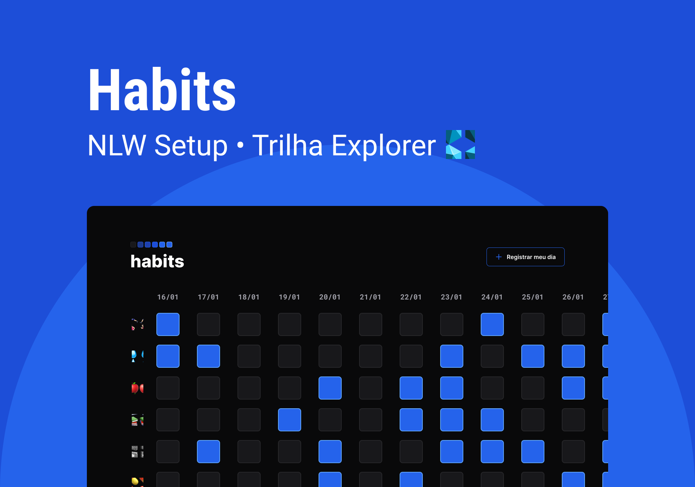

<h1 align="center">

</h1>

Projeto de assistente de controle de hábitos diários criado na **Trilha Explorer** da 11ª edição da Next Level Week da [Rocketseat](https://www.rocketseat.com.br/t), **NLW Setup**, que acontece entre 16 e 20 de janeiro de 2023. Participe também deste evento [clicando aqui](https://nlw.rocketseat.com.br/convite/emanuel-4451), de forma totalmente gratuita.

---

[Como baixar e executar](#-como-baixar-e-executar) • [Tecnologias utilizadas](#-tecnologias-utilizadas) • [Licença](#-licença)

---

## 📥 Como baixar e executar
Para baixar os arquivos deste repositório, você deve ter o [GitHub](https://desktop.github.com/) instalado em seu dispositivo.

Após instalado, você deverá acessar a guia `Arquivo` → `Clonar repositório` → `URL` e incluir o caminho `guedesert/nlw-setup`.

Além disso, é interessante que você tenha um bom editor para trabalhar com os códigos, dos quais eu recomendo o uso do [Visual Studio Code](https://code.visualstudio.com/). E também um navegador de internet, que eu indico que seja [Microsoft Edge](https://www.microsoft.com/pt-br/edge/download?form=MA13FJ) ou [Google Chrome](https://www.google.com/intl/pt-BR/chrome/).

Para visualizar e visitar o projeto on-line, basta acessá-lo [**clicando aqui**](https://guedesert.github.io/nlw-setup/).

## 🛠 Tecnologias utilizadas
Esse projeto foi desenvolvido com as seguintes tecnologias:
- Linguagens:
  - [HTML5](https://html.spec.whatwg.org/multipage/)
  - [CSS3](https://www.w3.org/Style/CSS/)
  - JavaScript
- IDEs:
  - [Visual Studio Code](https://code.visualstudio.com/)
- Prototipagem e geração de imagens:
  - [Figma](https://www.figma.com/)

## 📃 Licença
Este repositório está licensiado sob a [Licença MIT](./LICENSE).

---

Criado pela [Rocketseat 🚀](https://www.rocketseat.com.br/) e adaptado por [Emanuel Guedes](https://github.com/guedesert).

